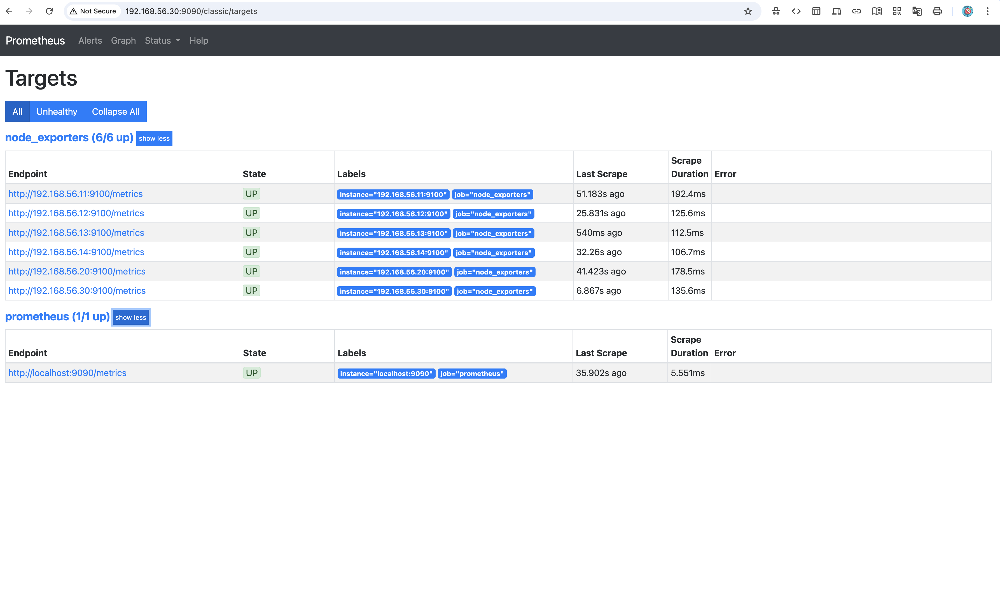
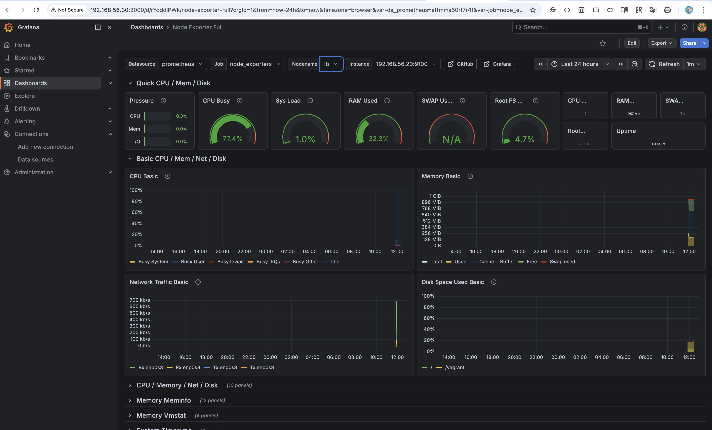
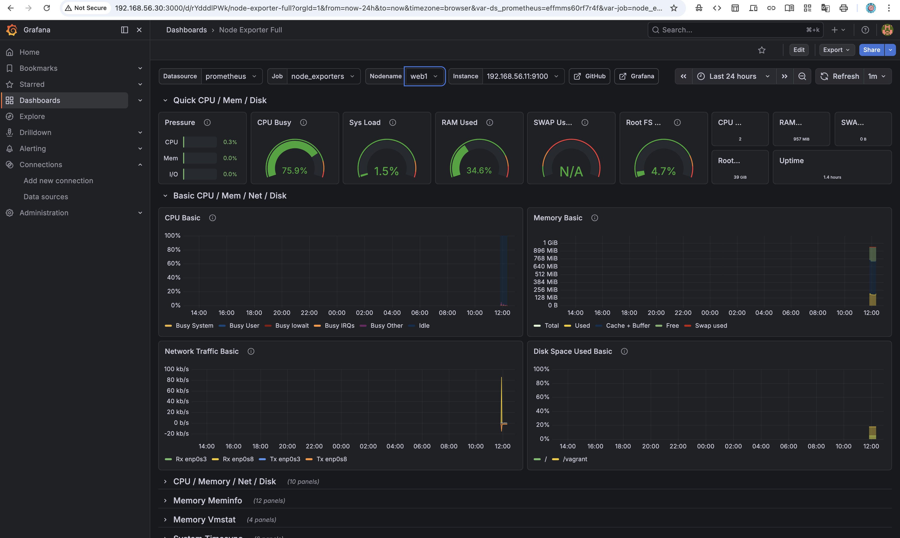
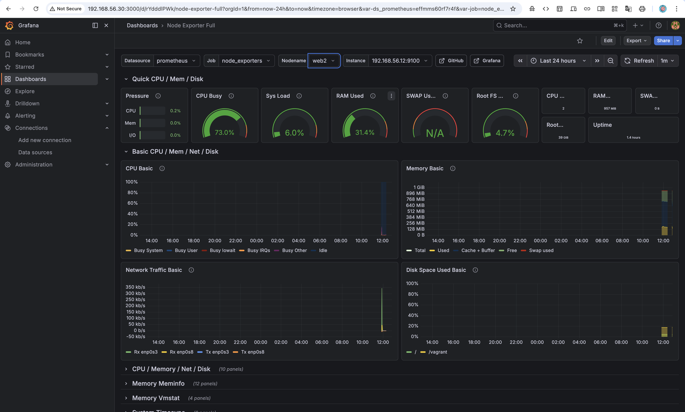
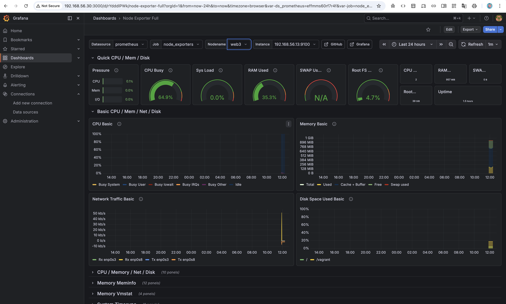
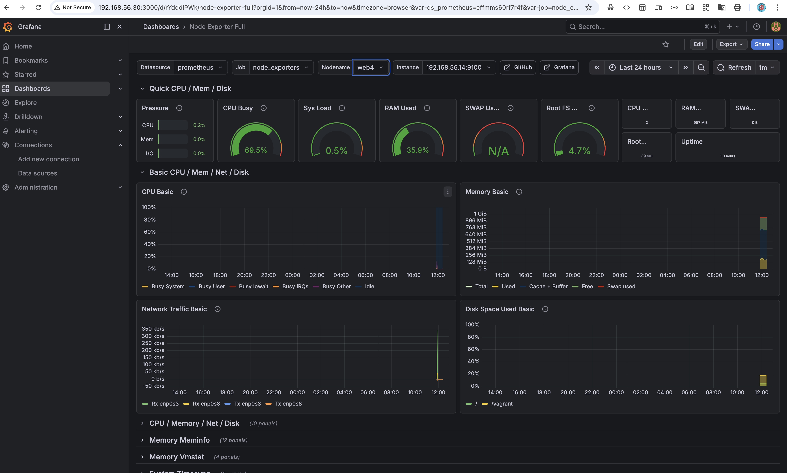
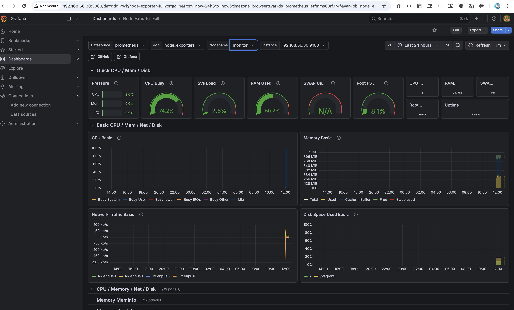
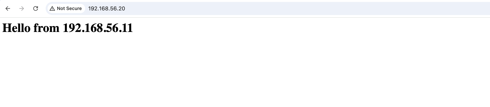

# SRE Infrastructure Deployment with Vagrant, Ansible and Monitoring

## Project Overview

This project demonstrates a **Site Reliability Engineering (SRE) infrastructure setup** using automation and monitoring tools.

The environment provisions multiple virtual machines, configures web servers and a load balancer, and deploys a centralized monitoring stack.

Infrastructure is provisioned using **Vagrant**, configuration is automated using **Ansible**, and monitoring is implemented using **Prometheus and Grafana**.

The system architecture consists of:

- 4 Web Servers
- 1 Load Balancer
- 1 Monitoring Server

System metrics from all servers are collected using **Node Exporter**, scraped by **Prometheus**, and visualized through **Grafana dashboards**.

---

# Architecture Diagram

                 Client
                   |
                   |
            Load Balancer (Nginx)
                192.168.56.20
                 /   /   /   \
                /   /   /     \
            web1 web2 web3  web4

       192.168.56.11
       192.168.56.12
       192.168.56.13
       192.168.56.14

             Monitoring Server
            Prometheus + Grafana
                 192.168.56.30

---

# Monitoring Layer

Node Exporter runs on all servers and exposes system metrics.

Prometheus collects these metrics and stores them.

Grafana visualizes the metrics through dashboards.

---

# Tools & Technologies

| Tool | Purpose |
|-----|--------|
| Vagrant | Virtual machine provisioning |
| VirtualBox | VM provider |
| Ansible | Configuration management |
| Nginx | Web server & load balancer |
| Prometheus | Metrics collection |
| Grafana | Monitoring dashboards |
| Node Exporter | System metrics exporter |

---

# Infrastructure Deployment

Infrastructure is created using **Vagrant**, which provisions multiple virtual machines.

---

Start infrastructure

---
vagrant up

Verify machines

vagrant status

---

This creates six virtual machines:

web1

web2

web3

web4

lb

monitor

---

# Server Configuration with Ansible

Ansible automates the installation and configuration of services across all servers.

Playbooks Used

webserver.yml

loadbalancer.yml

monitoring.yml

node_exporter.yml

# Test Connectivity

ansible all -i inventory.ini -m ping

Run Playbooks

ansible-playbook -i inventory.ini webserver.yml

ansible-playbook -i inventory.ini loadbalancer.yml

ansible-playbook -i inventory.ini monitoring.yml

ansible-playbook -i inventory.ini node_exporter.yml

# Web Server Deployment

All web nodes run Nginx and serve static web pages.

Example responses:

Hello from web1

Hello from web2

Hello from web3

Hello from web4

# Load Balancer

The load balancer uses Nginx as a reverse proxy.

# Traffic flow:

Client → Load Balancer → web1 / web2 / web3 / web4

Refreshing the browser distributes requests across all servers.

# Monitoring Setup

Monitoring is implemented using the following components:

Node Exporter

Prometheus

Grafana

Node Exporter collects system metrics from each server.

Prometheus scrapes the metrics and stores them.

Grafana visualizes metrics through dashboards.

# Access URLs

# Prometheus

http://192.168.56.30:9090

# Grafana

http://192.168.56.30:3000

Grafana Dashboard

Import Dashboard ID
1860

# This Dashboard Visualizes:

--CPU Usage

--Memory Usage

--Disk Usage

--Network Metrics

## Screenshots

### Prometheus Targets

### Grafana Dashboard

### Grafana Dashboard

### Grafana Dashboard

### Grafana Dashboard

### Grafana Dashboard

### Grafana Dashboard

### LoadBalancer Dashboard

